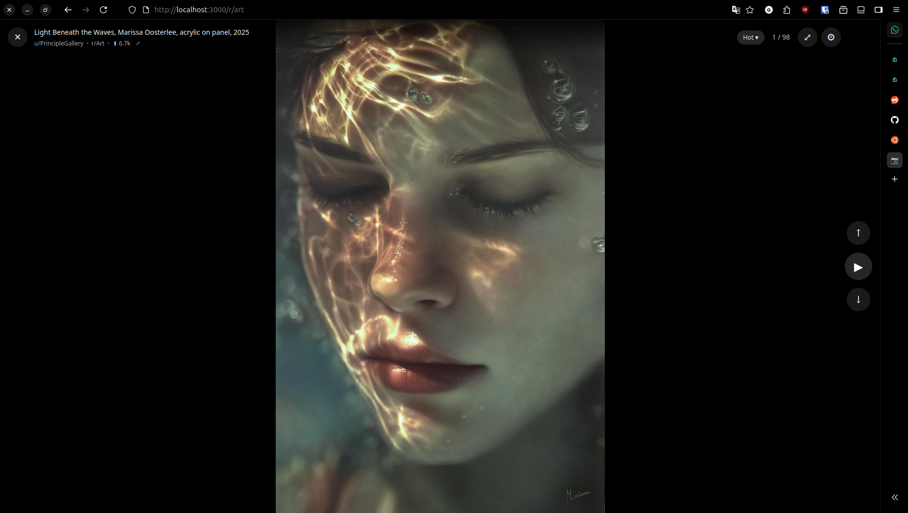

# RedditPics

A TikTok-style media viewer for Reddit. Swipe through images, videos, galleries, and GIFs from any subreddit in a fullscreen interface.

  

<p align="center">
  
</p>
<p align="center">
  
</p>

## Why?

- **No ads** - Just content
- **No tracking** - Self-hosted, no analytics
- **Customizable** - Tweak slideshow timing, filtering, and behavior
- **Private** - Runs on your machine, no account needed

## Features

- **Vertical swipe navigation** - Swipe up/down or use keyboard to browse
- **Multi-subreddit support** - Combine subreddits with `+` (e.g., `/r/pics+gifs+videos`)
- **Multiple media types** - Reddit images/videos, galleries, Imgur, Redgifs
- **Auto-advance slideshow** - Configurable delays for images and videos
- **Keyboard shortcuts** - Arrow keys, WASD, spacebar for play/pause
- **Settings panel** - NSFW filtering, video autoplay, slideshow timing
- **Fullscreen mode** - Press `F` for distraction-free viewing

## Quick Start

```bash
npm install
npm run dev
```

Open http://localhost:3000/r/pics

## Usage

### URL Format

```
http://localhost:3000/r/{subreddit}/{sort}?t={time}
```

- **subreddit**: Single (`pics`) or multi (`pics+gifs+videos`)
- **sort**: `hot`, `new`, `rising`, `top`, `controversial`
- **time** (for top/controversial): `hour`, `day`, `week`, `month`, `year`, `all`

### Examples

```
/r/pics                    # r/pics, hot
/r/pics/top?t=week         # r/pics, top of the week
/r/pics+gifs+videos/new    # multiple subreddits, new
```

### Keyboard Shortcuts

| Key | Action |
|-----|--------|
| `↑` `W` `K` | Previous post |
| `↓` `S` `J` | Next post |
| `←` `A` | Previous gallery image / Seek video -5s |
| `→` `D` | Next gallery image / Seek video +5s |
| `Space` | Toggle slideshow |
| `F` | Toggle fullscreen |
| `M` | Toggle mute |
| `I` | Toggle info overlay |

## Development

```bash
npm run dev          # Start dev server
npm run build        # Production build
npm run test:run     # Run tests
npm run lint         # Lint and fix
```

## Docker (Production)

Build and run:
```bash
docker build -t redditpics .
docker run -p 8080:80 redditpics
```

Then open http://localhost:8080/r/pics

Run in background with auto-restart:
```bash
docker run -d --name redditpics -p 8080:80 --restart unless-stopped redditpics
```

Stop/start:
```bash
docker stop redditpics
docker start redditpics
```

### Windows Setup

1. Install [Docker Desktop](https://docker.com/products/docker-desktop)
2. Open PowerShell in the project folder
3. Run the docker commands above

### Without Docker

The dev server handles API proxying, so you can run directly:
```bash
npm install
npm run dev
```

For production without Docker, you'll need a reverse proxy (nginx, Caddy, etc.) to proxy `/api/reddit/*` to `reddit.com` and `/api/redgifs/*` to `api.redgifs.com`.

## Tech Stack

- **Vue 3** with Composition API
- **Vite** for dev/build
- **TypeScript** for type safety
- **Vitest** for testing

## License

MIT
